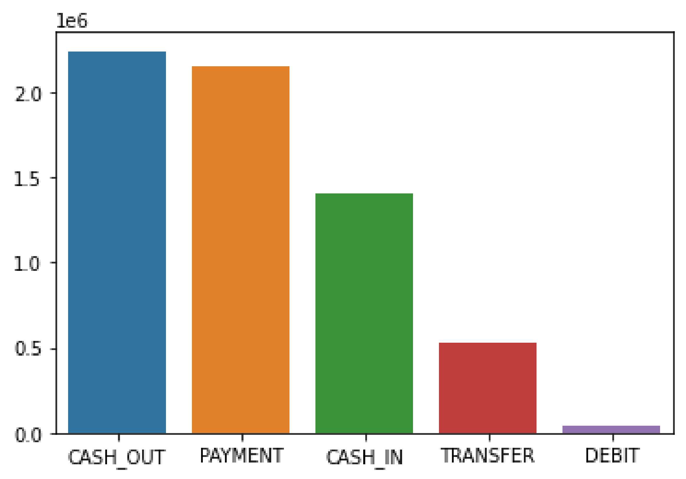
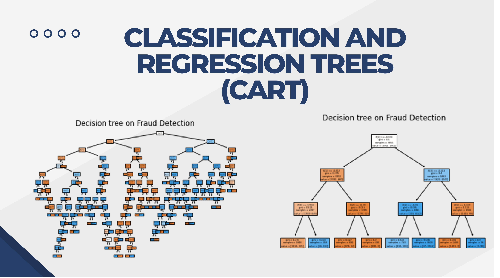
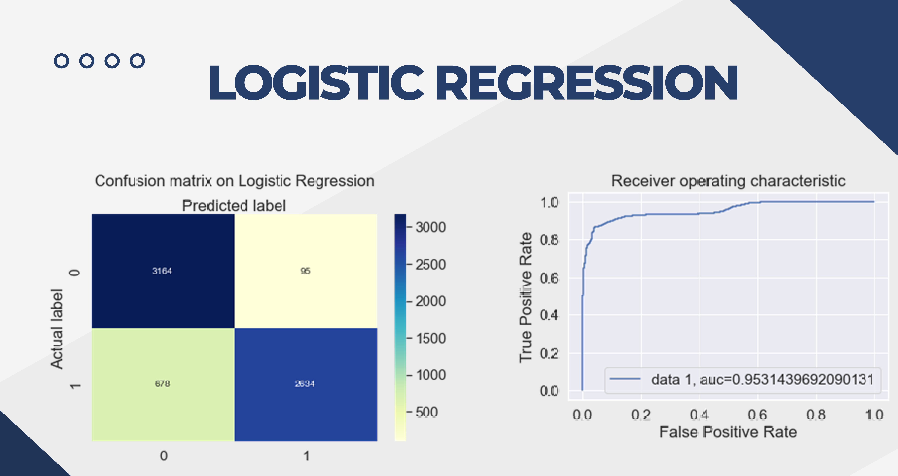

# Project 2: Fraud Detection Using Machine Learning — Portfolio Summary

## Short Summary: Built a machine learning fraud detection model using a dataset of 636K transactions. Performed preprocessing, correlation analysis, and EDA to understand fraud patterns. Tested multiple ML algorithms (KNN, XGBoost, Random Forest, CART, Logistic Regression, Naive Bayes). Many models showed extremely high accuracy due to overfitting caused by class imbalance. Logistic Regression was selected as the most reliable model. Insights highlight the importance of balanced data and model stability when detecting fraud at scale.

# Business Problem
Financial institutions face increasing risks due to fraudulent transactions. Detecting fraud early is critical to preventing financial loss, protecting customers, and ensuring secure digital payment systems. The goal of this project was to analyze historical financial transactions and identify fraudulent activity using machine learning techniques.

# Objective

Extract, transform, and analyze historical transaction data containing fraud labels

Build machine learning models to classify transactions as fraudulent or legitimate

Evaluate multiple algorithms to determine which delivers the most reliable performance

# Dataset Overview

The dataset includes 636,262 financial transaction records with features such as transaction type, amount, sender/receiver balances, and fraud indicators.
Key variables include:

type (PAYMENT, CASH_OUT, TRANSFER, etc.)

amount

oldbalanceOrg / newbalanceOrg

isFraud / isFlaggedFraud

# Methods & Approach

1. Preprocessing

Verified dataset completeness (no null values)

Performed dimension reduction using correlation analysis to identify relevant variables

Encoded transaction types using categorical mapping

2. Exploratory Data Analysis (EDA)

Examined imbalance in fraud classes (fraud cases extremely rare)

Visualized transaction type distributions

Mapped categorical variables for modeling

## Image 1 & 2: Visualizing the most occurring types of fraud.

## Image 3: Classification and regression tree

## Image 4: Confusion Matrix on Logistic Regression

## Machine Learning Models Tested

Multiple algorithms were evaluated to detect fraudulent transactions:

Algorithm	Accuracy
KNN	99%
XGBoost	99%
Random Forest	99%
CART (Decision Tree)	94%
Logistic Regression	89%
Naive Bayes	67%

# Key Findings

Many models achieved extremely high accuracy, indicating significant overfitting.

Fraud cases are highly imbalanced, causing inflated accuracy metrics.

Logistic Regression was recommended as the most stable model because it showed strong performance without overfitting.

# Conclusion / Business Impact

The study showed that machine learning can effectively detect fraud, but data imbalance must be addressed to avoid misleading results.
By using a stable model like Logistic Regression — combined with proper resampling techniques in future work — organizations can:

Identify fraudulent transactions earlier

Reduce financial loss

Strengthen risk management systems

